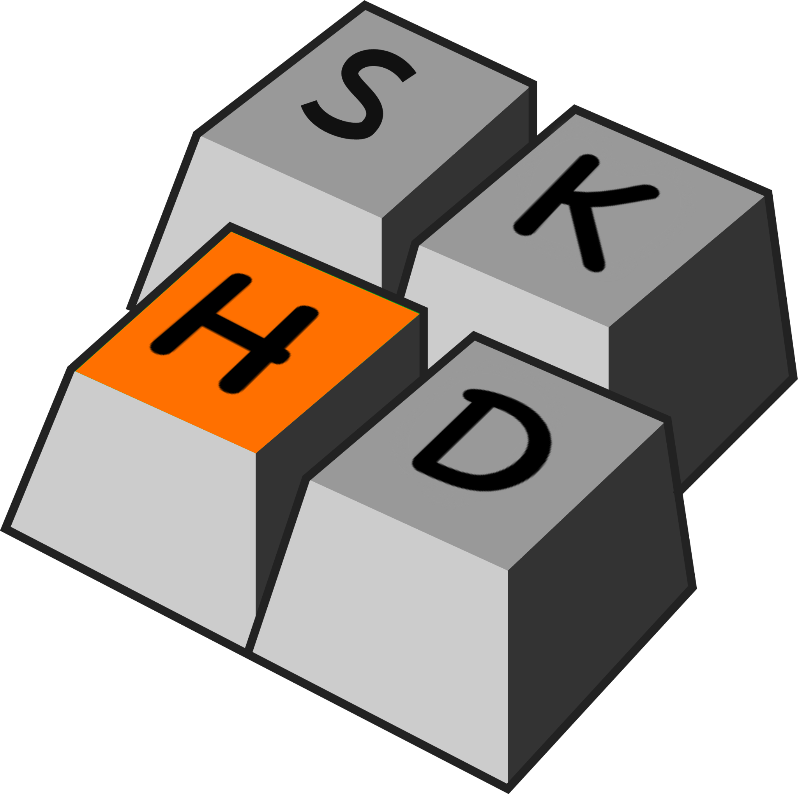
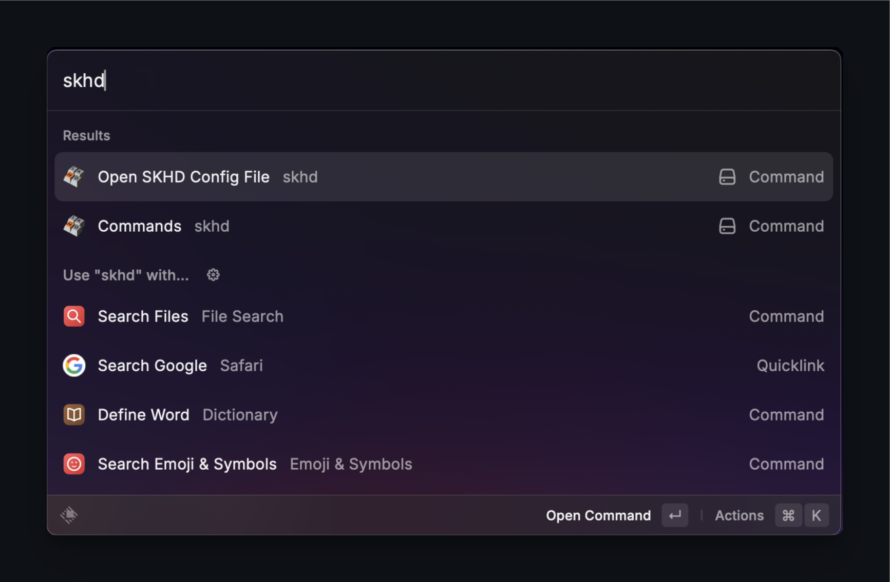
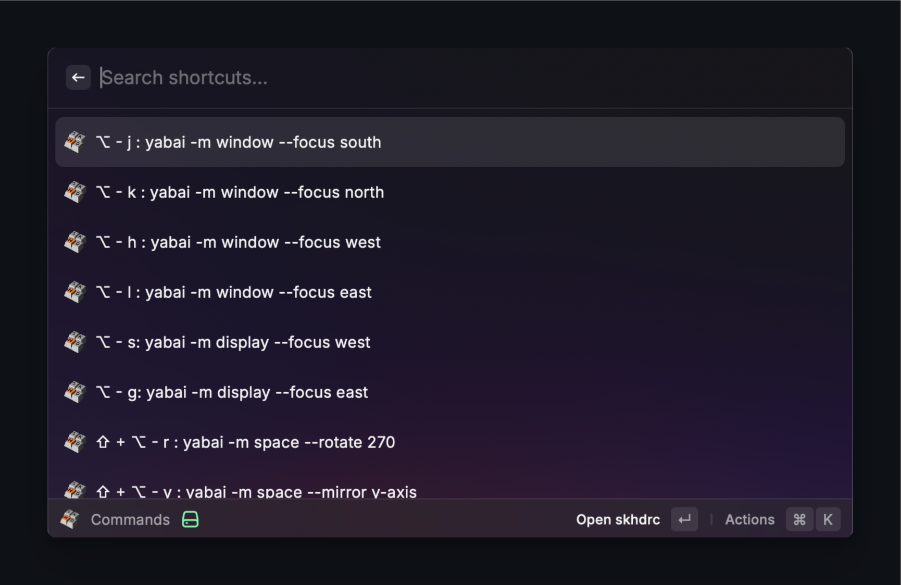

# skhd Manager for Raycast


<p align="center">
  
</p>


## Overview

**skhd Manager** is a Raycast extension designed to help you manage your [skhd](https://github.com/koekeishiya/skhd) shortcuts efficiently. This extension allows you to display all SKHD commands, open the configuration file, and customize settings such as the path to the `skhdrc` file and the editor used to open it.


## Previews

<p align="center">
  
</p>

<p align="center">
  
</p>

## Links and Acknowledgments

- [yabai GitHub Repository](https://github.com/koekeishiya/yabai)
- [skhd GitHub Repository](https://github.com/koekeishiya/skhd)

A big shout-out to [koekeishiya](https://github.com/koekeishiya) for creating both `yabai` and `skhd`. These tools have revolutionized window management and key binding on macOS.

## Add to Your Raycast

*Pending approval.*

## Manual Usage

### Installation

To install and run this extension locally, follow these steps:

1. **Clone the Repository**: Clone the extension repository to your local machine.
   ```bash
   git clone <repository_url>
   ```

2. **Navigate to the Directory**: Navigate to the extension's directory.
   ```bash
   cd skhd-manager
   ```

3. **Install Dependencies**: Install the required dependencies using npm.
   ```bash
   npm install
   ```

4. **Develop Mode**: Run the extension in development mode.
   ```bash
   npm run dev
   ```
   Or, use the Raycast-specific command:
   ```bash
   ray develop
   ```

5. **Build**: To create a production build of the extension.
   ```bash
   npm run build
   ```

## Extra Notes

- **Custom Paths and Editors**: You can specify a custom path to the `skhdrc` file and the editor command in the extension settings. If not set, it defaults to `~/.config/skhd/skhdrc` and the default editor, respectively.

- **Cautions**: 
  - Ensure that the specified `skhdrc` file path is correct and accessible. Incorrect paths may result in errors when trying to open the file.
  - When specifying a custom editor command, make sure that the command is available in your system's PATH and can be executed from any directory. For example, `code` for Visual Studio Code or `subl` for Sublime Text.
  - This extension requires permission to execute commands and access specified file paths. Ensure that the necessary permissions are granted in macOS security settings, especially under "Security & Privacy" > "Privacy" > "Accessibility".

- **Backup Configuration**: Before making changes to your `skhdrc` file, it's advisable to create a backup. This can help prevent accidental loss of important configurations.

- **Troubleshooting**: 
  - If the extension does not work as expected, check the Raycast console for error messages. This can provide insight into what might be going wrong.
  - Ensure that your Raycast app and the extension are up to date.

- **Disclaimer**: Use this extension at your own risk. The author is not responsible for any data loss or other issues that may arise from using this extension.

This extension is designed to enhance the usability of `skhd` by providing an easy-to-use interface within Raycast. Enjoy managing your shortcuts with ease!

